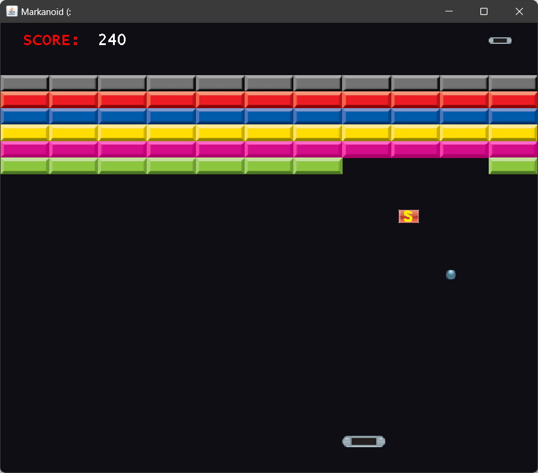
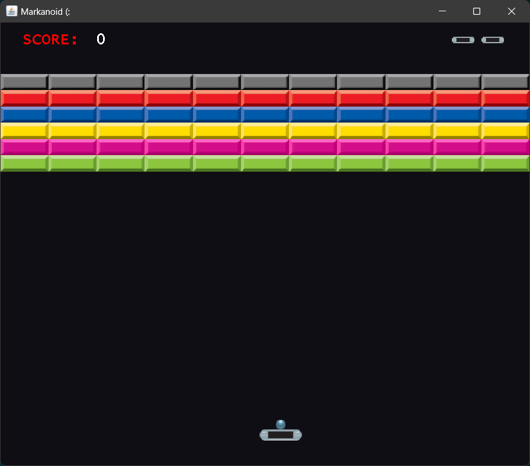
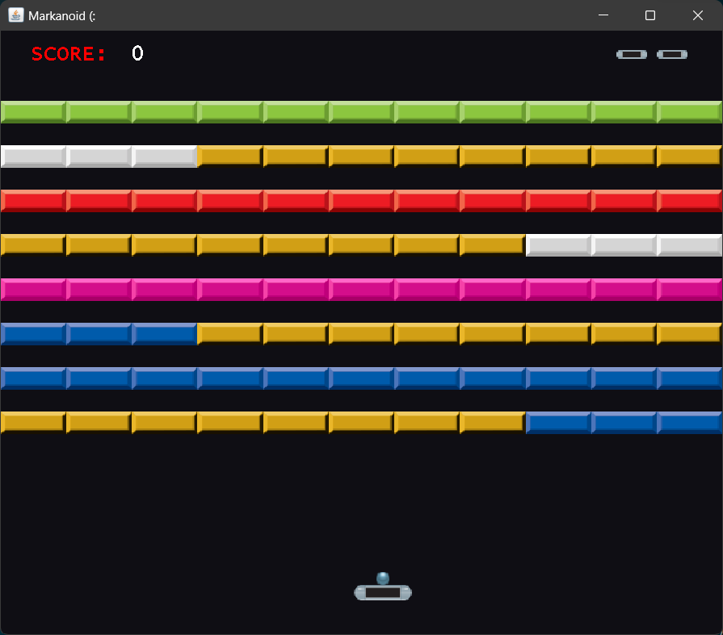

# Markanoid

[About](#about) ◈ [Installation](#installation) ◈ [How to use](#how-to-use) ◈ [Features](#features) ◈ [How are points calculated?](#how-are-points-calculated)

## About

> [!NOTE]  
> This project was made for a school assignment. It is no longer maintained.

Markanoid (Mock Arkanoid) is a replica of 2 levels of the arcade game Arkanoid. It includes sound effects and power-ups for the authentic experience.

## Installation

### Windows

1. Download source code as a *.zip* file
2. Unzip it into a new folder

## How to use

1. Run *Markanoid.java*
2. Select the level using up/down arrow keys
    - Level 1 corresponds to round 1 on the arkanoid map; level 2 corresponds to round 3
3. Press Enter to confirm selection and go to the level screen
4. Press Space to launch the ball and use the left/right arrow keys to move the platform

## Features

- Two levels

  
  

- 3 powerup types
  -  : Makes the paddle Longer
  -  : Makes the ball Slow down
  -  : Creates 2 more Duplicates of the ball
- Different points for each colour of block (see below)
- Displays high score

## How are points calculated?

| Block | Number of points |
|---|---|
|  | 50 |
|  | 60 |
|  | 70 |
| | 80 |
|  | 90 |
|  | 100 |
|  | 110 |
|  | 120 |
|  | 50x the level number |
|  | 0 ("wall") |